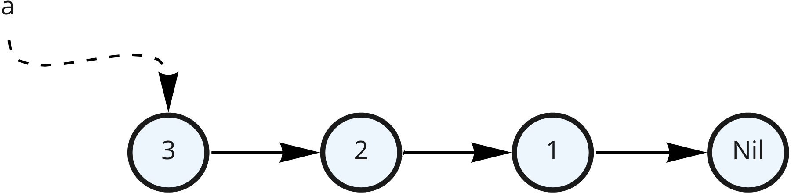
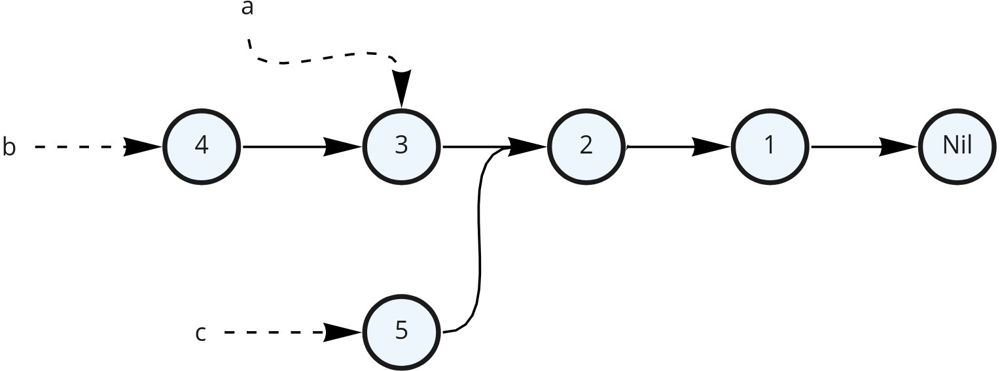
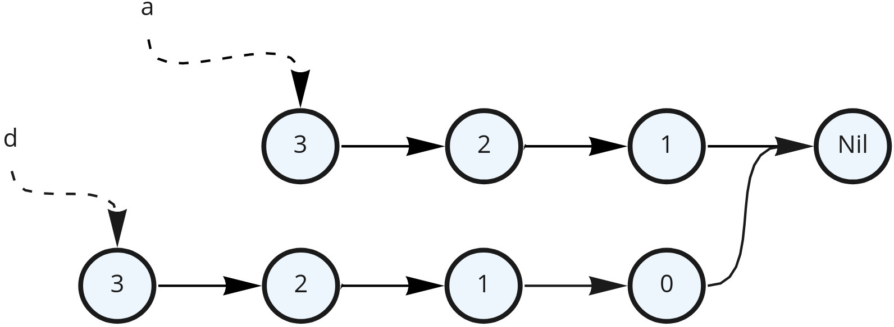
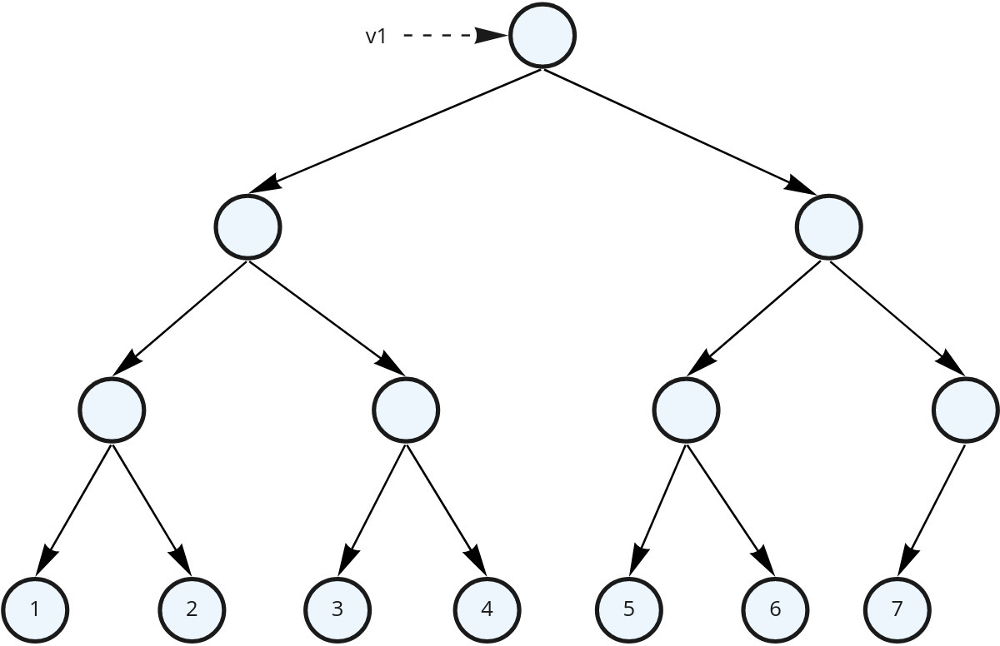

# Alternatively: Software Design with Values<br />(for Java 17)

# Java >= 10 features that grabbed my attention

::: { .fragment }

```
Useful for FP

JEP 395: Records (https://openjdk.java.net/jeps/395)
JEP 361: Switch Expressions (https://openjdk.java.net/jeps/361)
JEP 394: Pattern Matching for instanceof (https://openjdk.java.net/jeps/394)
JEP 406: Pattern Matching for switch (Preview) (https://openjdk.java.net/jeps/406)
JEP 409: Sealed Classes (https://openjdk.java.net/jeps/409)

Other language features

JEP 378: Text Blocks (https://openjdk.java.net/jeps/378)
JEP 286: Local-Variable Type Inference (https://openjdk.java.net/jeps/286)

Libraries

JEP 321: HTTP Client (https://openjdk.java.net/jeps/321)
JEP 266: More Concurrency Updates (https://openjdk.java.net/jeps/266)
...
```

:::

# Java

::: incremental

* Started as a quite imperative language
* But more and more functional features and style are popping up
* Declarative annotations have took over the norm in the last decade and more
* Why is that happening?
* How can FP style improve our codebase?

:::

# Me

* FP enthusiast
* Using mostly Scala at the moment
* Strong interest in distributed systems and domain design
* Used to be part of CFC Reporting
* Now in ISF (Store Pick) Orchestration & Planning team

# Imperative programming

::: incremental

* We command the computer what to do
  * Step-by-step instructions (statements)
  * Executed over time (sequence is important)
* Places (variables) of data that change constantly
  * Saves memory
  * Control over memory access (good for optimizations)
* Hard to follow – we have to keep in mind every change and the order in which changes happen

:::

# Software is not about memory places

::: incremental

* The heart of a software is working with information
* and transforming information to something useful
* Information is a collection of facts
  * data, events, actions, time passing, ...
* Which lead to derived (often aggregated) facts and actions taken
  * actions from software perspective is sending a derived fact to another component/system
* Facts are values
* They don't change!
* ["The Value of Values", Rich Hickey](https://www.youtube.com/watch?v=-I-VpPMzG7c)

:::

# Functional Programs

::: incremental

* They describe transformations of values
* Declarative – we describe “what” we want to get instead of “how” to get it
  
  ```scala
  val top100Adults = competitors
    .filter(_.age >= 18)
    .map(_.score)
    .sorted(Ordering[Int].reverse)
    .take(100)
  
  val top100AdultsAverage = top100Adults.avg
  ```
* A composition of expressions and definitions
  * each expression has a value and a type
* Expressions are the only thing that define dependencies!
  * as there is nothing that can change. Just new values produced

:::

# Functional Programs

::: incremental

* Easy to follow and to reason about
  * Every variable is always the same, it always has the same meaning
  * The time has “stopped”
* Easy to compose different parts
  * What matters is only their value
  * We just have to match the types and the compiler helps us with that
  * “Guided by the types”
* Constraints enable!

:::

# Buut… Doesn’t Things Change Over Time?

```java
var oldZdravko = new Person("Zdravko", 32, "Varna", "Bulgarian");
var newZdravko = oldZdravko
       .withAge(oldZdravko.age() + 1)
       .withAddress("Sofia");

oldZdravko.sayHiTo(newZdravko);
```

::: incremental

* Both versions are a fact that was true at certain point in time
* Immutable values give us a snapshot in time
* A thing that can be identified and changes over time is called **an entity**
  * often we are interested in the latest state of an entity
  * but previous ones bring us additional information

:::

# But for a result to be observed shouldn't we make changes?

::: incremental

* A.k.a. do a side effect?
* In the end we do need to tell the computer what to do
* When using FP we push such side effects to just specific (and controlled) places, usually the outer edges of the program

:::

# Functional Wizard

{ height="512" }

Controls time & space

# There is actually a space for both

* Imperative is invaluable for some algorithms and performance optimizations
* Functional makes the rest of the program easier to implement, grasp and compose

# How can we achieve immutable values in Java?

::: incremental

* Basic Java types (primitives and Strings) are immutable
* Immutable values are easily composed into more complex structures
* Algebraic Data Types – a type formed by combining other types
  * Product types (Java 16 Records)
  * Sum types (Java 17 sealed types and patern matching for switch)
  * Exponential types (Java 8 function types)

:::

# Product types

::: incremental

* A cartesian product of simpler types
  * model a "has-a" relationship
* `Type1 x Type2 x Type3 x ...`
* Often denoted as `(Type1, Type2, Type3, ...)`
* A product type has `|Type1| * |Type2| * |Type3| * ...` possible instances
* Example: `(boolean, byte)` is a product type
* It has `2 * 256` possible values

:::

# Records

Records are named product types

```java
record Person(String name, int age, String location) {
    public String sayHi() {
        return String.format("Hello, I am %s from $s.", name, location);
    }
}

var geri = new Person("Geri", 30, "Plovdiv");
var extendedGreeting = String.format("%s I am %d years old.", 
        geri.sayHi(), geri.age());
// Hello, I am Geri from Plovdiv. I am 30 years old.
```

::: { .fragment }

They cannot be mutated. Once instantiated their value is fixed

:::

# Partial initialization is a source for bugs

If `Person` was a Java Bean:

```java
var geri = new Person();
geri.setName("Geri");
geri.setLocation("Plovdiv");

// ...

var extendedGreeting = String.format("%s I am %d years old.",
        geri.sayHi(), geri.age());
// Hello, I am Geri from Plovdiv. I am null years old.
```

::: incremental

* No one told us that we forgot the age
* If we add a property the compiler won't complain it's not initialized
* Partial (incomplete) data is hard to work with (especially when unexpected)
  * Records guarantee all data is there and safe to work with
* Thread unsafe – Java doesn't guarantee us that if we share `geri` with another thread it will see its values

:::

# Group related values into their own meaningful records

```java
record Person(
    String name, 
    int age, 
    String country, 
    String city,
    String street
) {}
```

::: { .fragment }

Instead do:

```java
record Address(String country, String city, String street) {}
record Person(String name, int age, Address address) {}
```

:::

::: incremental

* Easier to understand (each part of the record has specific semantic)
* Address can be reused and transformed on its own
* A composition

:::

# Put proper domain boundaries between values and between entities<br />(depending on the context)

::: incremental

* Most of the time a person is not defined by their bank account. The bank account can be seen as a separate concern
* A self-contained entity is often called Aggregate and defines transactional boundaries

:::

# Immutable Records in Time

```java
public record Person(String name, int age, Address address) {
   public Person getOlder() {
       return new Person(name, age + 1, address);
   }
}
public record Address(String country, String city, String street) {}


var youngRadost = new Person("Radost", 24, new Address("Bulgaria", "Veliko Tarnovo", "ul. Roza"));
var olderRadost = youngRadost.getOlder();
```

::: { .fragment }

{ height=300 }

:::

# Immutable Records in Time

```java
public record Person(String name, int age, Address address) {
   public Person getOlder() {
       return new Person(name, age + 1, address);
   }
}
public record Address(String country, String city, String street) {}


var youngRadost = new Person("Radost", 24, new Address("Bulgaria", "Veliko Tarnovo", "ul. Roza"));
var olderRadost = youngRadost.getOlder();
```

Immutability enables:

* Persistence – both `youngRadost` and `olderRadost` remain valid objects.
  * Helps with code robustness, especially in concurrent and multi-threaded environments
* Structural sharing
  * Both objects share most of its internal objects
  * We didn’t have to copy the whole state so it was a fast (constant) operation.

# What other value objects do we have?

::: incremental

* Data structures
* They can be part of a product type, just like any other value type
* Java comes with only mutable data structures, which negate many of the benefits and can cause problems

:::

# Immutable data structures

::: { .fragment }

We will use [Vavr](https://www.vavr.io/) for the examples

:::

# Immutable List

```java
import io.vavr.collection.List;

var xs = List.of(1, 2, 3);
xs.head(); // 1
xs.tail(); // List(2, 3)

var emptyList = List.<Integer> empty();
var singleElementList = emptyList.prepend(3);
var multiElementList = singleElementList.prepend(2).prepend(1).prepend(0);

multiElementList.take(2); // List(0, 1)
multiElementList.drop(2); // List(2, 3)
multiElementList.size(); // 4; works in linear time
```

# How does List work?

```java
var a = List.of(3, 2, 1);
```

::: { .fragment }

{ height=120 }

:::

# How does List work?

```java
var a = List.of(3, 2, 1);
var b = a.prepend(4);
var c = a.tail().prepend(5);
```

::: { .fragment }

{ height=240 }

:::

::: incremental

* Persistence
* Structural sharing
* If any variable goes out of scope any unused remaining objects will be GCed

:::

# Adding an element to the end

```java
var a = List.of(3, 2, 1);
var d = a.append(0);
```

::: { .fragment }

{ height=240 }

:::

::: { .fragment }

We cannot share common objects here. The operation is linear

:::

# Vector – efficient random access

```java
var v1 = Vector.of(1, 2, 3, 4, 5, 6, 7);
```

::: { .fragment }

{ height=380 }

:::

::: { .fragment }

A balanced tree

:::

# Vector – efficient random access

```java
var v1 = Vector.of(1, 2, 3, 4, 5, 6, 7);
v1.head(); // 1
v1.last(); // 7
v1.get(4); // 5
```

::: { .fragment }

{ height=380 }

:::

::: { .fragment }

All three operations have the same complexity – log<sub>2</sub>n

:::

# Vector – replacing an element

```java
var v1 = Vector.of(1, 2, 3, 4, 5, 6, 7);
var v2 = v1.update(5, 42);
```

::: { .fragment }

{ height=420 }

:::

# Vector in Vavr

* A tree with 32 children for each node
* The complexity of operations is log<sub>32</sub>n
  * This is considered “effectively constant”
* Useful when random access to elements is needed
* The structure is called [Radix Balanced Tree](https://docs.google.com/presentation/d/1GY0p2P-BzPfWspKoMRxOQ87fG01t4oMJ1PJxjxGFurQ/edit)

# Other Structures

* HashSet and HashMap
  * Similar idea
  * Implemented via Hash array mapped trie [HAMT](https://lampwww.epfl.ch/papers/idealhashtrees.pdf)
* SortedSet and SortedMap
  * Red-Black trees are perfect for immutable data structures
* Queue, PriorityQueue

#  Benefits when using immutable values<br />(thus far)

::: incremental

* Persistence and structural sharing
* Safe sharing between components 
  * No need for "ownership" concept. No one own it
  * GC takes care to free up unused stuff
  * No need for defensive copying when nothing can change
* Especially helpful for concurrent systems (more on this later)
* Everything has clear inputs and outputs
    * `void` function signatures tell you nothing
* Composable
* Reproducible results
    * The same input always lead to the same output
    * Perfect for tests

:::

# Sum Types

::: incremental

* A disjoint union of types
  * model a "is-a" relationship
* `type ABCSum = A | B | C` – either `A` or `B` or `C`
* `|ABCSum| = |A| + |B| + |C|`
* `Byte | Boolean` has 2 + 256 = 258 elements

:::

# Enums are Sum Types

`type Suit = Clubs | Diamonds | Hearts | Spades`:

```java
enum Suit {
    Clubs, Diamonds, Hearts, Spades;
}
```

# A Sum Type of Product Types ([Sealed Types](https://openjdk.java.net/jeps/409))

```java
public sealed interface Whereabouts {
   record AtLocation(String locationId) implements Whereabouts {}
   record InContainer(String containerId, String containerPosition) implements Whereabouts {}
   record InMover(String moverId) implements Whereabouts {}
}
```

::: incremental

* `sealed` says no other implementations of `Whereabouts` exists apart from the listed here
* This a domain-specific sum type
* They are actually quite common in domains

:::

# Working with alternatives

::: incremental

* `type Whereabouts = AtLocation | InContainer | InMover` suggests that we need to branch depending on the case
* To make this easy Java introduced two improvements on switch:
  * made it an expression
  * branching per type (a.k.a. switch pattern matching)

:::

::: { .fragment }

```java
String describeWhereabouts(Whereabouts whereabouts) {
   return switch (whereabouts) {
       case Whereabouts.AtLocation atLocation ->
               String.format("At location: %s: ", atLocation.locationId());
       case Whereabouts.InContainer inContainer ->
               String.format("In container: %s: ", inContainer.containerId());
       case Whereabouts.InMover inMover ->
               String.format("In mover: %s ", inMover.moverId());
   };
}

```

:::

# If we miss a case it won't compile

```java
String describeWhereabouts(Whereabouts whereabouts) {
   return switch (whereabouts) {
       case Whereabouts.AtLocation atLocation ->
               String.format("At location: %s: ", atLocation.locationId());
       case Whereabouts.InContainer inContainer ->
               String.format("In container: %s: ", inContainer.containerId());
   };
}

// error: the switch expression does not cover all possible input values
```

# Sum types vs OOP

::: incremental

* Sum types are exhaustive – no other variant can appear
  * Adding a variant automatically breaks the code at compile time
* OOP subtype polymorphism has unrestricted subtyping
  * Anyone can add a variant at any time. They just need to follow the interface
  * Adding an operation automatically breaks the code at compile time
* There are types suited for sum typing and types suited for OOP
  * Know the difference. Choosing the right one can help or domain design a lot

:::

# Sum Type – Make Illegal States Unrepresentable

What if we have implemented `Whereabouts` like this:

```java
enum WhereaboutsType {
    AtLocation, InContainer, InMover
}

record Whereabouts(WhereaboutsType whereaboutsType, String entityId,
                   String containerPosition) {}
```

::: incremental

* This pattern can be seen often in Java
* `containerPosition` should be illegal for `AtLocation` and `InMover`. This definition doesn't communicate that
* `entityId` becomes quite a generic name and requires all the IDs to be of the same type. It's quite easy to mix them up

:::

# Interoperability with TypeScript

```typescript
type Whereabouts = AtLocation | InContainer | InMover

type AtLocation = {
  type: "AtLocation",
  locationId: string
}

type InContainer = {
  type: "InLocation",
  containerId: string,
  containerPosition: string
}

type InMover = {
  type: "InMover",
  moverId: string
}
```

# Interoperability with TypeScript

```typescript
function describeWhereabouts(whereabouts: Whereabouts) {
  switch (whereabouts.type) {
    case "AtLocation": return `At location ${whereabouts.locationId}`;
    case "InContainer":
      return `InContainer ${whereabouts.containerId}(${whereabouts.containerPosition})`;
    case "InMover": return `In mover ${whereabouts.moverId}`;
  }
}
```

# Describing Possible States with Sum Types

```java
sealed interface BeloteRoundState {
   record Initial(List<Card> deck) implements BeloteRoundState {}
   record Bidding(List<Hand> hands, Biddings biddings, List<Card> deck) implements BeloteRoundState {}
   record Playing(List<Hand> hands, takes, announcements, ...) implements BeloteRoundState {}
   record Finished(takes, announcements, ...) implements BeloteRoundState {}
}
```

::: { .fragment }

Each of these would probably also have different behaviour

:::

# Lists can be implemented as a sum type:

```java
sealed interface List<T> {
    record Cons<T>(T head, List<T> rest) implements List<T> {}
    record Nil<T>() implements List<T> {}
}
```

# `null`s are dangerous. Make optionality explicit

```java
sealed interface Option<T> {
    record Some<T>(T element) implements Option<T> {}
    record None<T>() implements Option<T> {}
}
```

::: { .fragment }

```java
record InContainer(String containerId, Option<String> containerPosition) {}
```

:::

::: incremental

* Forces you to handle the optionality
* Such types come with use case-specific set of helper functions (e.g. `map`, `flatMap`, `getOrElse`, etc) that transform them as values

:::

# Exceptions are not values:

::: incremental

* Throwing an exception is a side effect
* Not a value that we can easily transform or share
* Exception handling is bound to the current thread. It’s not easy to share the exception with other threads
* Hard to compose:
  
  ```java
  try {
      try {
      } finally {
      }
      try {
          try {
          } finally {
          }
      } finally {
      }
  } finally {
      try {
      } finally {
      }
  }
  ```

:::

# Errors as values:

```java
// Either a success or an exception (as a value)
sealed interface Try<T> {
    record Success<T>(T value) implements Try<T> {}
    record Failure<T>(Throwable e) implements Try<T> {}
}

// Either a success (Right) or a custom error (Left)
sealed interface Either<E, T> {
    record Right<E, T>(T value) implements Either<E, T> {}
    record Left<E, T>(E e) implements Either<E, T> {}
}
```

::: incremental

* Errors become values that can easily be transformed and composed
* Can be shared between componets, threads or even other systems on the network
* Useful for domain-specific error handling
  * Forces the user to handle the possibility for error (if needed)
  * For programmer errors and pre-condition checks still prefer exceptions
* Such types are called **effects**
* How to use them is a topic of another talk

:::

# In what other ways are immutable values helpful?

# Concurrency

::: { .fragment }

```java
public class Counter {
  AtomicReference<Map<Integer, Integer>> counters = new AtomicReference<>(HashMap.empty());

  public void increment(int key) {
    counters.updateAndGet(currentMap -> {
      var currentValue = currentMap.getOrElse(key, 0);

      return currentMap.put(key, currentValue + 1);
    });
  }
}
```

:::

# Storage

* Append-only logs are everywhere nowadays
  * write-ahead logs, LSM (log-structured merge-tree), Kafka as unified log, ...
  * Each entry is an immutable fact
  * storage can easily be replicated or processed just by reading the log

# Storage

* Software-Transactional Memory
  * Each entity has a version history marked by transaction id (or a timestamp)
  * This allows consistent reads without acquiring any locks
  * A transaction manager for updating entities (uses atomic operations instead of logs)
  * Fast thanks to structural sharing
* MVCC – similar idea for DBs
  * Used in PostgreSQL
  * Tuples (rows) in PostgreSQL are immutable
  * Vacuuming process for garbage collection

# Distributed Systems

* Messages that systems exchange are values
  * defined by protocols
* Communication via events/facts
  * Event Sourcing – instead a history of state keep a history of events 
  * Events capture intent, states don't
* Stream processing
* Big data

# Git

Git is a distributed system that use persistent data structures with structural sharing

# UI

* Immutability is extremely convenient for UI
* Example: Redux provides one big immutable aggregated value as a state
* There are strict rules on how to update the state

# One more front-end example

::: incremental

* With redux we often have to track async operations state
* We end up with properties like:

  ```typescript
  {
    orders: {
      items: Array<Order>,
      isLoading: boolean,
      hasError: Error
    }
  }
  ```
* This can be a nightmare to maintain

:::

# Alternative: `AsyncResult`

```typescript
type AsyncResult<E, T> = Success<T> | Failure<E> | IsLoading
// definitions...

// The redux object can then be:
{
  orders: AsyncResult<OrderError, Array<Order>>
}
```

::: { .fragment }

The type should come with utilities to compose `AsyncResult`s into bigger values

:::

# [Immutability Changes Everything](https://queue.acm.org/detail.cfm?id=2884038)

A review by Pat Helland of uses of immutability in various contexts

# What if programs themselves were a value?

{ .fragment }

# Programs as values

```scala
val program = for {
  _     <- IO.println("What is your name?")
  name  <- IO.readln
  _     <- IO.println(s"Hello, $name, welcome!")
} yield ExitCodes.Success

// Nothing is executed yet

program.unsafeRun() // Explicitly start the side effects

List(program, program, program).map(_.unsafeRun()) // Run the program three times
```

::: { .fragment }

[Library HTTP Client in Scala](https://github.com/scala-fmi/scala-fmi-2021/tree/master/lectures/examples/12-library-app/src/main/scala/fmi/client)

:::

# Questions :)?

# Thank you for attending!
